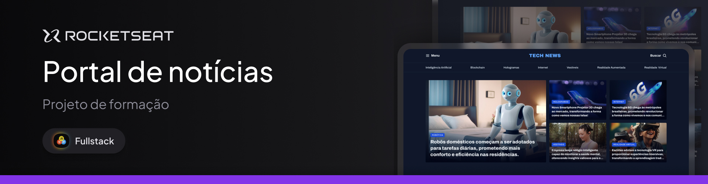

# Projeto de formação - Portal de Notícias

Este projeto é a homepage de um portal de notícias sobre tecnologia para ser visualizado em um desktop. Esse é um dos projetos desenvolvidos em aula na formação Full-stack da @Rocketseat.

## Conceitos aprimorados

- Estrutura HTML
- Display Grid
- CSS Modular
  
> [Live Demo 🚀](https://santos-vinicius.github.io/technews/)
